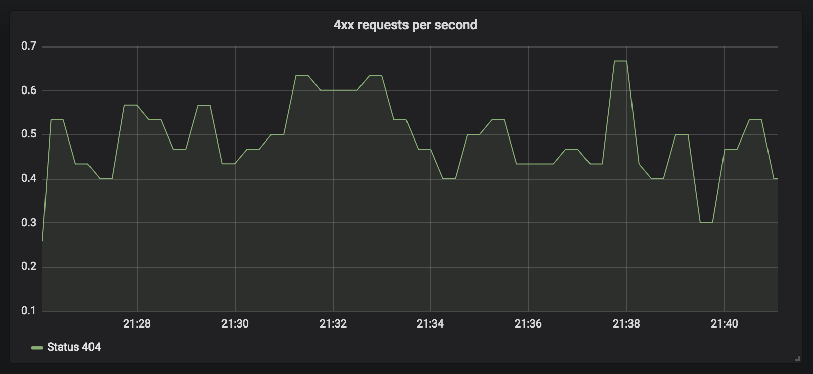
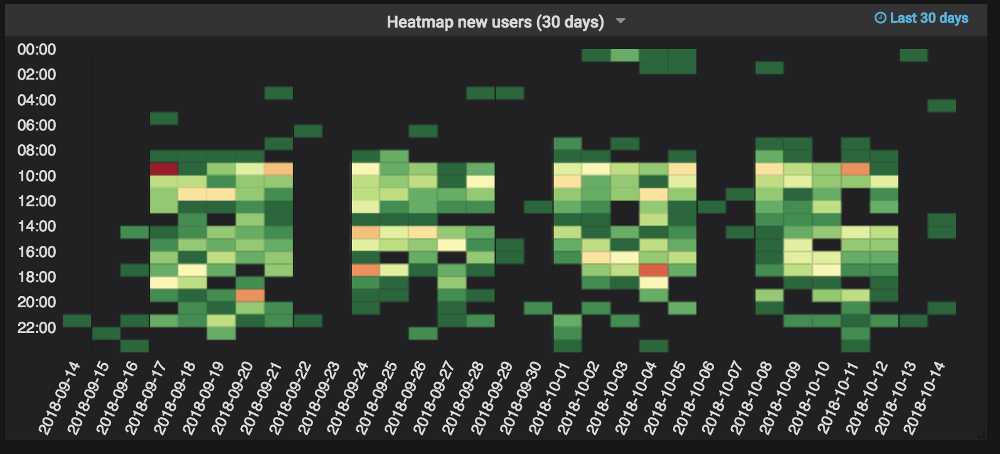

## Your Prometheus and Grafana environment is starting
Give it some time to load all the images and start up. It is happening as you read these lines automatically.

You can find grafana on port 3000:

https://[[HOST_SUBDOMAIN]]-3000-[[KATACODA_HOST]].environments.katacoda.com

username:**grep** password:**demo**


In this exercise we will also use Loki, Grafana's log agregation engine. It has been added to the `workshop-prometheus-grafana/docker-compose.yml`{{open}} file and started as you read this instruction.

## Prepare Docker-Compose for logging to Loki

Change directory to 
`cd workshop-prometheus-grafana`{{execute}}

Install Loki Docker logging driver before starting the compose stack

`docker plugin install grafana/loki-docker-driver:latest --alias loki --grant-all-permissions`{{execute}}

Stop your solution
`docker-compose down`{{execute}}

Start Docker-Compose Stack
`docker-compose up -d`{{execute}}

## Explore the new solution
Play around with the solution...

Notice that you have a Loki datasource in Explore view.

## Additional documentation:
https://grafana.com/docs/loki/latest/clients/docker-driver/configuration/

## Monitor services: nginx, postgresql...

### Export Nginx and PostgreSQL metrics

There are two new containers to produce logs for our learning environment. A simple Nginx web server and a PostgreSQL DB.

These are already added to your docker-compose environment. All you need to do is add them to your prometheus monitoring configuration.

## Configure nginx exporter

You can see that in the `workshop-prometheus-grafana/docker-compose.yml`{{open}} we nave an Nginx web server. We also defined a container that contains a metrix exporter for nginx called nginx-exporter. The exporter exposes nginx metrix on the port 9101

You can check the metrics that is exposed here:

https://[[HOST_SUBDOMAIN]]-9101-[[KATACODA_HOST]].environments.katacoda.com/metrics

Update `workshop-prometheus-grafana/prometheus.yml`{{open}} config file, to scrape nginx-exporter metrics every 10 seconds.

<pre class="file" data-filename="workshop-prometheus-grafana/prometheus.yml" data-target="insert"  data-marker="#NGINXEXPORTER">  - job_name: 'nginx-exporter'
    scrape_interval: 10s
    static_configs:
      - targets: ['nginx-exporter:9101']
</pre>

Restart prometheus service.

```
docker-compose restart prometheus
```{{execute}}

Check what prometheus sees as targets:

https://[[HOST_SUBDOMAIN]]-9090-[[KATACODA_HOST]].environments.katacoda.com/targets

## Configure postgresql exporter

You can see that in the `workshop-prometheus-grafana/docker-compose.yml`{{open}} we nave an postgresql db. We also defined a container that contains a metrix exporter for postgresql called postgresql-exporter. The exporter exposes nginx metrix on the port 9187

You can check the metrics that is exposed here:

https://[[HOST_SUBDOMAIN]]-9187-[[KATACODA_HOST]].environments.katacoda.com/metrics

Update `workshop-prometheus-grafana/prometheus.yml`{{open}} config file, to scrape postgresql-exporter metrics every 10 seconds.

<pre class="file" data-filename="workshop-prometheus-grafana/prometheus.yml" data-target="insert"  data-marker="#PGSQLEXPORTER">  - job_name: 'postgresql-exporter'
    scrape_interval: 10s
    static_configs:
      - targets: ['postgresql-exporter:9187']
</pre>

Restart prometheus service.

```
docker-compose restart prometheus
```{{execute}}

Check what prometheus sees as targets:

https://[[HOST_SUBDOMAIN]]-9090-[[KATACODA_HOST]].environments.katacoda.com/targets

### Generate some metrics

Send tens of requests to Nginx on localhost:8080 (200, 404...) and fill PostgreSQL database:

### 2xx
```
./infinite-200-req.sh
```{{execute}}

### 4xx
```
./infinite-404-req.sh
```{{execute}}

### inserts data into pg
```sh
./infinite-pg-insert.sh
```{{execute}}

### Import PG dashboards to Grafana

Go on [https://grafana.com/dashboards](https://grafana.com/dashboards) and find a dashboard for PostgreSQL, compatible with Prometheus and wrouesnel/postgres_exporter.

<details>
  <summary>💡 Solution</summary>

  Those exporters looks nice: [https://grafana.com/dashboards/6742](https://grafana.com/dashboards/6742), [https://grafana.com/dashboards/6995](https://grafana.com/dashboards/6995).

</details>

### Create Nginx dashboards

Display 2 graphs:

- number of 2xx http requests per second

- number of 4xx http requests per second

Tips: you should use `sum by(<label>) (<metric>)` and `irate(<metric>)` (cf PromQL doc).



<details>
  <summary>💡 Solution</summary>

  Query graph 1: `sum by (status) (irate(nginx_http_requests_total{status=~"2.."}[1m]))`

  Legend graph 1: `Status: {{ status }}`

  Query graph 2: `sum by (status) (irate(nginx_http_requests_total{status=~"4.."}[1m]))`

  Legend graph 2: `Status: {{ status }}`

</details>

## Export some business metrics

Let's display in real time:

- number of users
- number of posts per user

### Export data

Grab custom metrics with `postgresql-exporter` by adding queries to `custom-queries.yml`:

- Metric `user_count` of type `counter` => `SELECT COUNT(*) FROM users;`
- Metric `post_per_user_count` of type `gauge` with user_id and email in labels => `SELECT u.id, u.email, COUNT(*) FROM posts p JOIN users u ON u.id = p.user_id GROUP BY u.id;`

Example and syntax [here](https://github.com/wrouesnel/postgres_exporter/blob/master/queries.yaml).

[http://localhost:9187/metrics](http://localhost:9187/metrics) should output:

```
[...]

# HELP user_count_count Number of users
# TYPE user_count_count counter
user_count_count 2

# HELP post_per_user_count_count Number of posts per user
# TYPE post_per_user_count_count gauge
post_per_user_count_count{email="foobar@gmail.com",id="e1c10ca1-60c8-405c-a9f3-3ff41456ca9f"} 1
post_per_user_count_count{email="samuel@grep.to",id="fde08ee6-5fb9-4c4f-9b40-dc2ad69bb855"} 2

[...]
```

<details>
  <summary>💡 Solution</summary>

  Append to `custom-queries.yml`:

```yaml
user:
  query: "SELECT COUNT(*) FROM users;"
  metrics:
    - count:
        usage: "COUNTER"
        description: "Number of users"

post_per_user:
  query: "SELECT u.id, u.email, COUNT(*) FROM posts p JOIN users u ON u.id = p.user_id GROUP BY u.id;"
  metrics:
    - count:
        usage: "GAUGE"
        description: "Number of posts per user"
    - id:
        usage: "LABEL"
        description: "User id"
    - email:
        usage: "LABEL"
        description: "User email"

```

</details>

### Graph time!

With `user_count{}` and `post_per_user_count{id,email}` metrics, build following graphs:

Simple graph of users signup (`rate(<metric>)`):


Heatmap of signups (`increase(<metric>)`):

```
docker-compose exec grafana grafana-cli plugins install petrslavotinek-carpetplot-panel
```{{execute}}

```
docker-compose restart grafana
```{{execute}}



Table of top 10 users per post count (`topk()`, `sum by(<label>) (<metric>)`):


<details>
  <summary>💡 Solution</summary>

  Query 1: `rate(user_count{}[1m])`

  Query 2: `increase(user_count{}[$__interval]) > 0`

  Query 3: `topk(10, sum by (id, email) (post_per_user_count{}) > 0)`

</details>

### Expose /metrics from a micro-service

You can play with this sample in NodeJS: [microservice-demo/README.md](microservice-demo/README.md).

Don't forget to update Prometheus configuration in `prometheus.yml` !

## More ideas to exercise

- Monitor a Redis server, a RabbitMQ cluster, Mysql...
- Increase data retention (15d by default).
- Setup alerting with AlertManager and basic rules
- Setup Prometheus service discovery (consul, etc, dns...) to import configuration automatically
- Limits: multitenancy - partitionning/sharding - scaling - cron tasks
