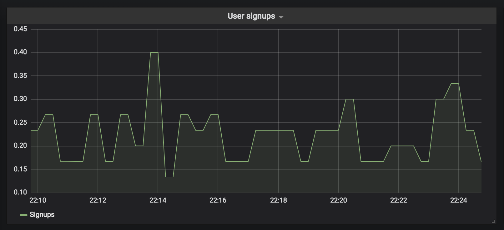

## 1 - Metrics types

Take a look on Prometheus metric types (counter, gauges, histogram, summary) => [https://prometheus.io/docs/concepts/metric_types/](https://prometheus.io/docs/concepts/metric_types/)

## 2 - Start Prometheus

```
# Starts Prometheus
docker-compose up -d prometheus

# Starts system metrics exporter
docker-compose up -d node-exporter
```

- Prometheus console: [http://localhost:9090](http://localhost:9090).
- Full list of ingested metrics: [http://localhost:9090/graph](http://localhost:9090/graph).
- `node-exporter` metrics: [http://localhost:9100/metrics](http://localhost:9100/metrics).

## 3 - Let's grab some system metrics (memory, CPU, disk...)

Update `prometheus.yml` config file, to scrape node-exporter metrics every 10 seconds. 🚀

<details>
  <summary>💡 Solution</summary>

  ```
#
# /etc/prometheus/prometheus.yml
#

global:
  scrape_interval: 30s

scrape_configs:
  - job_name: 'node-exporter'
    scrape_interval: 10s
    static_configs:
      - targets: ['node-exporter:9100']
  ```

</details>

## 4 - Execute your first PromQL query

**PromQL documentation**:

- basic: [https://prometheus.io/docs/prometheus/latest/querying/basics/](https://prometheus.io/docs/prometheus/latest/querying/basics/)

- advanced: [https://prometheus.io/docs/prometheus/latest/querying/functions/](https://prometheus.io/docs/prometheus/latest/querying/functions/)

### 4.0 - Memory usage

Go to [http://localhost:9090/graph](http://localhost:9090/graph) and write a query displaying a graph of free memory on your OS.

Metric name is `node_memory_MemFree_bytes`.

<details>
  <summary>💡 Solution</summary>

  Query: `node_memory_MemTotal_bytes{}`
</details>

### 4.1 - Human readable

Same metric but in GigaBytes ?

<details>
  <summary>💡 Solution</summary>

  Query: `node_memory_MemTotal_bytes{} / 1024 / 1024 / 1024`
</details>


### 4.2 - Relative to total memory

Same metric, but in percent of total available memory ?

Tips: `node-exporter` metrics are prefixed by `node_`.

<details>
  <summary>💡 Solution</summary>

  Query: `(node_memory_MemTotal_bytes{} - node_memory_MemFree_bytes{}) / node_memory_MemTotal_bytes{} * 100`
</details>

## 5 - Setup Grafana

Uncomment grafana in docker-compose.yml and launch it:

```
docker-compose up -d grafana
```

Open [http://localhost:3000](http://localhost:3000) (user: grep / pass: demo).

Add a new datasource to Grafana.

- Mode: `server`
- Pointing to http://prometheus:9090


## 6 - Hand-made dashboard

Add a new dashboard to Grafana.

### 6.0 - Simple graph

Create a graph showing current memory usage.

<details>
  <summary>💡 Solution</summary>

  Query: `(node_memory_MemTotal_bytes{} - node_memory_MemFree_bytes{}) / node_memory_MemTotal_bytes{} * 100`

  
</details>

### 6.1 - Some formatting

Grafana should be displaying graph in %, such as:


<details>
  <summary>💡 Solution</summary>

  
</details>

### 6.2 - CPU load

In the same dashboard, add a new graph for CPU load (1min, 5min, 15min).

Tips: you will need a new metric prefixed by `node_`.


<details>
  <summary>💡 Solution</summary>

  
</details>

### 6.3 - Disk usage

In the same dashboard, add a new graph for `sda` disk usage (ko written per second).

You will need `rate()` PromQL function: [https://prometheus.io/docs/prometheus/latest/querying/functions/#rate](https://prometheus.io/docs/prometheus/latest/querying/functions/#rate)


<details>
  <summary>💡 Solution</summary>

  Query:
  `rate(node_disk_written_bytes_total{device="sda"}[30s])`

</details>

## 7 - Dashboards from community

Let's import a dashboard from Grafana website.

- "Node Exporter Full" dashboard: [https://grafana.com/dashboards/1860](https://grafana.com/dashboards/1860)
- Or "Node Exporter Server Metrics" dashboard: [https://grafana.com/dashboards/405](https://grafana.com/dashboards/405)
- Or both ;)

Those dashboards are only compatible with Prometheus data-source and node-exporter.


## 8 - Monitor services: nginx, postgresql...

### 8.1 - Export Nginx and PostgreSQL metrics

Uncomment `postgres`, `postgresql-exporter` and `nginx-exporter` services in docker-compose.yml, and launch containers.

```
docker-compose up -d nginx-exporter
docker-compose up -d postgres postgresql-exporter
```

Update Prometheus configuration to scrape Nginx and PostgreSQL exporters.

<details>
  <summary>💡 Solution</summary>

  ```yml
scrape_config:

  [...]

  - job_name: 'postgresql-exporter'
    static_configs:
      - targets: ['postgresql-exporter:9187']

  - job_name: 'nginx-exporter'
    static_configs:
      - targets: ['nginx-exporter:9101']
  ```

  Then `docker-compose exec prometheus kill -HUP 1`
</details>

Check everything is working well here: [http://localhost:9090/targets](http://localhost:9090/targets)

Take a look on `/metrics` routes of exporters: [http://localhost:9187/metrics](http://localhost:9187/metrics) + [http://localhost:9101/metrics](http://localhost:9101/metrics)

### 8.2 - Generate some metrics

Send tens of requests to Nginx on localhost:8080 (200, 404...) and fill PostgreSQL database:

```sh
# 2xx
./infinite-200-req.sh

# 4xx
./infinite-404-req.sh
```

```sh
# inserts data into pg
./infinite-pg-insert.sh
```

### 8.3 - Import PG dashboards to Grafana

Go on [https://grafana.com/dashboards](https://grafana.com/dashboards) and find a dashboard for PostgreSQL, compatible with Prometheus and wrouesnel/postgres_exporter.

<details>
  <summary>💡 Solution</summary>

  Those exporters looks nice: [https://grafana.com/dashboards/6742](https://grafana.com/dashboards/6742), [https://grafana.com/dashboards/6995](https://grafana.com/dashboards/6995).

</details>

### 8.4 - Create Nginx dashboards

Display 2 graphs:

- number of 2xx http requests per second

- number of 4xx http requests per second

Tips: you should use `sum by(<label>) (<metric>)` and `irate(<metric>)` (cf PromQL doc).


<details>
  <summary>💡 Solution</summary>

  Query graph 1: `sum by (status) (irate(nginx_http_requests_total{status=~"2.."}[1m]))`

  Legend graph 1: `Status: {{ status }}`

  Query graph 2: `sum by (status) (irate(nginx_http_requests_total{status=~"4.."}[1m]))`

  Legend graph 2: `Status: {{ status }}`

</details>

## 9 - Export some business metrics

Let's display in real time:

- number of users
- number of posts per user

### 9.0 - Export data

Grab custom metrics with `postgresql-exporter` by adding queries to `custom-queries.yml`:

- Metric `user_count` of type `counter` => `SELECT COUNT(*) FROM users;`
- Metric `post_per_user_count` of type `gauge` with user_id and email in labels => `SELECT u.id, u.email, COUNT(*) FROM posts p JOIN users u ON u.id = p.user_id GROUP BY u.id;`

Example and syntax [here](https://github.com/wrouesnel/postgres_exporter/blob/master/queries.yaml).

[http://localhost:9187/metrics](http://localhost:9187/metrics) should output:

```
[...]

# HELP user_count_count Number of users
# TYPE user_count_count counter
user_count_count 2

# HELP post_per_user_count_count Number of posts per user
# TYPE post_per_user_count_count gauge
post_per_user_count_count{email="foobar@gmail.com",id="e1c10ca1-60c8-405c-a9f3-3ff41456ca9f"} 1
post_per_user_count_count{email="samuel@grep.to",id="fde08ee6-5fb9-4c4f-9b40-dc2ad69bb855"} 2

[...]
```

<details>
  <summary>💡 Solution</summary>

  Append to `custom-queries.yml`:

```yaml
user:
  query: "SELECT COUNT(*) FROM users;"
  metrics:
    - count:
        usage: "COUNTER"
        description: "Number of users"

post_per_user:
  query: "SELECT u.id, u.email, COUNT(*) FROM posts p JOIN users u ON u.id = p.user_id GROUP BY u.id;"
  metrics:
    - count:
        usage: "GAUGE"
        description: "Number of posts per user"
    - id:
        usage: "LABEL"
        description: "User id"
    - email:
        usage: "LABEL"
        description: "User email"

```

</details>

### 9.1 - Graph time!

With `user_count{}` and `post_per_user_count{id,email}` metrics, build following graphs:

Simple graph of users signup (`rate(<metric>)`):



Heatmap of signups (`increase(<metric>)`):

```
docker-compose exec grafana grafana-cli plugins install petrslavotinek-carpetplot-panel
docker-compose restart grafana
```


Table of top 10 users per post count (`topk()`, `sum by(<label>) (<metric>)`):


<details>
  <summary>💡 Solution</summary>

  Query 1: `rate(user_count{}[1m])`

  Query 2: `increase(user_count{}[$__interval]) > 0`

  Query 3: `topk(10, sum by (id, email) (post_per_user_count{}) > 0)`

</details>

### 9.2 - Expose /metrics from a micro-service

You can play with this sample in NodeJS: [microservice-demo/README.md](microservice-demo/README.md).

Don't forget to update Prometheus configuration in `prometheus.yml` !

## 42 - More

- Monitor a Redis server, a RabbitMQ cluster, Mysql...
- Increase data retention (15d by default).
- Setup alerting with AlertManager and basic rules
- Setup Prometheus service discovery (consul, etc, dns...) to import configuration automatically
- Limits: multitenancy - partitionning/sharding - scaling - cron tasks
